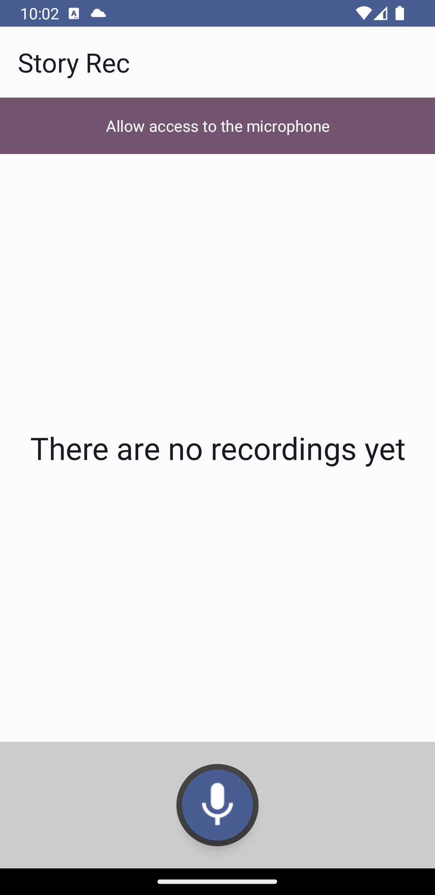
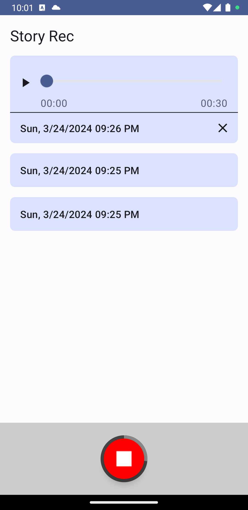

# voice-recorder-android

A dictaphone app where users can record and log short voice messages. The app keeps history of the
recordings so users can play them later.

# Brief Project Description (Android, Kotlin, Jetpack Compose App, MVVM)

I created this project using the default Android Studio New App template (Empty Activity),
implementing it as a Kotlin Jetpack Compose project.

Android Studio Iguana | 2023.2.1 Patch 1 | gradle-8.4

In the build.gradle file, the only change made was to add a dependency to an extended icons library
to include Mic and Stop icons for the Record/Stop Button.

In the Manifest, I added user permissions for recording audio and wake lock to keep the screen on
while playing audio. Additionally, I declared the microphone feature as required to ensure app
compatibility with devices equipped with a microphone.

I used standard default colors throughout the project.

I reused components from previous projects, making minor updates:

1. The Record/Stop button (RecordButton), which includes a circle gauge indicating the time
   remaining until the end of recording (capped at 1 minute - can be updated in Config).

2. To avoid making the screen too busy, I introduced two list item view components. The regular
   item (ItemView) displays only the time of recording, while the selected item allows users to play
   the audio, control feedback, and delete the recording (SelectedItemView).

I implemented a variation of the MVVM pattern, where HomeScreen serves as the view, RecordingItem as
the data model, HomeViewModel manages most of the UI state and references the HomeRepository for
loading the history of recordings from the disk and deleting audio files if necessary.

I did not introduce Hilt for dependency injection and Timber as a logger, which I usually include in
my projects. However, I did try to handle most possible edge cases and errors.

Initial Screen  | A few recording added
:-------------------------:|:-------------------------:
 | 

Contact
=================================
Contact and follow me on LinkedIn: https://www.linkedin.com/in/sergey-neskoromny-86662a10/