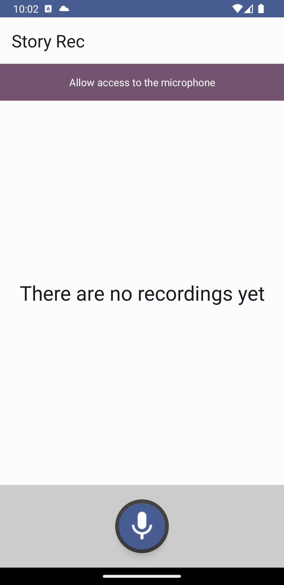
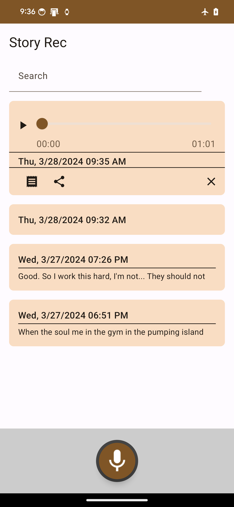
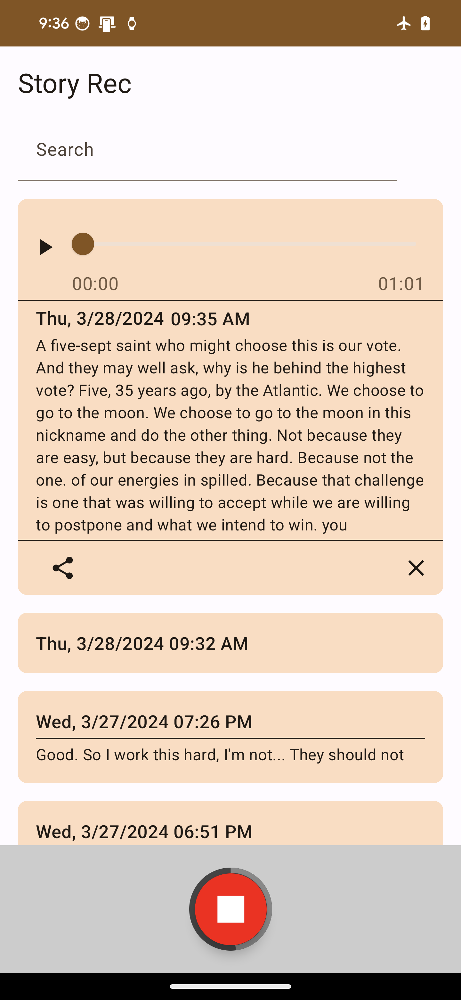

# Android Voice Recorder Demo App (Kotlin, Jetpack Compose, MVVM, JNI, OpenAI Whisper, and TensorFlow Lite)

This is a dictaphone app where users can record and log short voice messages. The app maintains a
history of recordings, allowing users to play them later. Users can transcribe selected recordings,
search through recordings by transcribed text, delete recordings, and share selected items. When a
user plays a recording, subsequent recordings automatically play in descending order.

## Brief Project Description

This project was created using the default Android Studio New App template (Empty Activity) and
implemented as a Kotlin Jetpack Compose project.

### Environment

- Android Studio Iguana | 2023.2.1 Patch 1
- Gradle Version: 8.4

### Changes Made

- Added dependency to an extended icons library for Mic and Stop icons for the Record/Stop Button.
- Added user permissions for recording audio and wake lock to keep the screen on while playing
  audio.
- Declared the microphone feature as required for compatibility with devices equipped with a
  microphone.

### Components

1. **Record/Stop Button**: Includes a circle gauge indicating the remaining time until the end of
   recording (capped at 1 minute).
    - [RecordButton](https://github.com/sergenes/voice-recorder-android/blob/main/app/src/main/java/com/sergey/nes/recorder/ui/components/RecordButton.kt)
2. **List Item View Components**:
    - Regular item (ItemView): Displays only the recording time.
    - Selected item (SelectedItemView): Allows users to play audio, control feedback, and delete the
      recording.
    - [ItemViews](https://github.com/sergenes/voice-recorder-android/blob/main/app/src/main/java/com/sergey/nes/recorder/ui/components/ItemViews.kt)

### Architecture

- MVVM pattern:
    - View: [HomeScreen](https://github.com/sergenes/voice-recorder-android/blob/main/app/src/main/java/com/sergey/nes/recorder/ui/home/HomeScreen.kt)
    - Data Model: [RecordingItem](https://github.com/sergenes/voice-recorder-android/blob/main/app/src/main/java/com/sergey/nes/recorder/models/DataModels.kt)
    - ViewModel: [HomeViewModel](https://github.com/sergenes/voice-recorder-android/blob/main/app/src/main/java/com/sergey/nes/recorder/ui/home/HomeViewModel.kt)
    - Repository: [HomeRepository](https://github.com/sergenes/voice-recorder-android/blob/main/app/src/main/java/com/sergey/nes/recorder/ui/home/HomeRepository.kt)

## TODO:

- Integrate Hilt for dependency injection.
- Add MVI implementation for comparison.
- Add Timber as a logger.
- Add functionality to share audio files and transcriptions.
- Add navigation and a Settings screen.
- Add UI/Unit tests.
- Experiment with different models to make the transcriber work for languages other than English and
  generate timecodes for transcribed words to highlight them synchronously with audio playback.

## Offline Speech Recognition (Transcription) with OpenAI Whisper and TensorFlow Lite

The offline transcription in this project based
on [vilassn](https://github.com/vilassn/whisper_android). This Whisper implementation transcribes
only English audio to English text and Any Language audio to Translated to English text. The project
includes the Whisper Tiny Model (39M parameters), TensorFlow Lite, and FlatBuffers.

I updated the `transcribeFile` function in `TFLiteEngine.cpp` to support audio files longer than 30
seconds, although testing has been limited to 60-second files. Also, I had to fix the wav recorder,
as it saved wav file with the size of maximum buffer size regardless actual recording duration.

## How to generate TFLite model from Whisper

The original Whisper models are in PyTorch format and needs to be converted into TensorFlow Lite
format.
[Google Colab](https://colab.research.google.com/github/usefulsensors/openai-whisper/blob/main/notebooks/generate_tflite_from_whisper.ipynb)

## Screenshots

<table>
  <tr>
    <td>Initial screen</td>
     <td>A few recording added</td>
     <td>A transcription example</td>
  </tr>
  <tr>
    <td></td>
    <td></td>
    <td></td>
  </tr>
 </table>

## Download

Note that this APK contains whisper-tiny.tflite model, so it is heavy, around 100 MB. Also, make
sure your Android device allows installation of APKs from sources other than Google Play.
[Story Rec Demo App](https://answersolutions.net/voice-rec-release.apk)

## Contact

Connect and follow me on LinkedIn: [Sergey N](https://www.linkedin.com/in/sergey-neskoromny/)